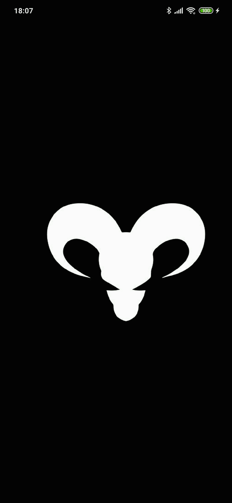
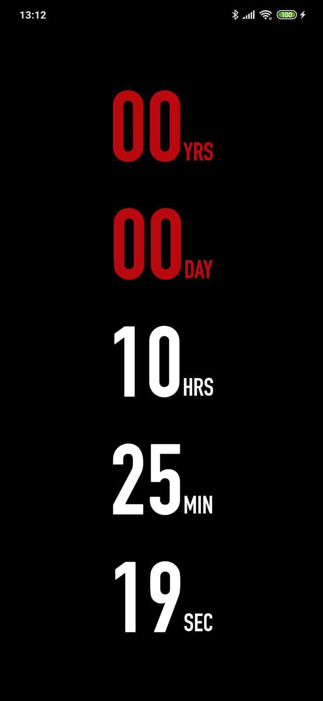
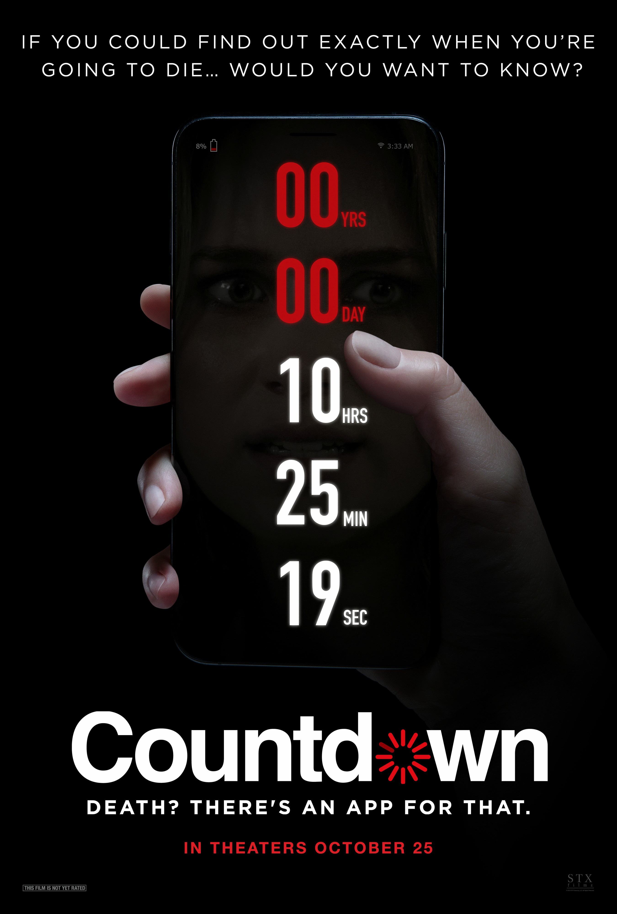

<h1>Countdown App</h1>
 

 
 
 

## 📃 Description

    Countdown App is an identical copy of the app shown in the [Countdown Movie](https://www.imdb.com/title/tt10039344/). It's a simple date generator with a countdown timer and a couple of scary notifications and sounds, the app was made with [React-Native](https://github.com/facebook/react-native).

## 📅 Date Generation

    The *"death date"* is generated based on the Device HardwareID, the reason for this is to prevent a different date from being generated if the user reinstall or deletes the application data.

## 🚀 Motivation

- Make an exact copy of the movie application and and post it on Google Play.

- Study local only notifications and how to trigger sound when app is on background.

- Improve my knowledge in React-Native while building a responsive frontend design.

### 🎨 Preview

